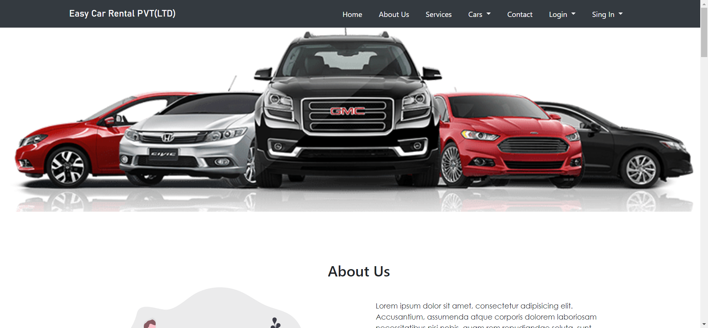
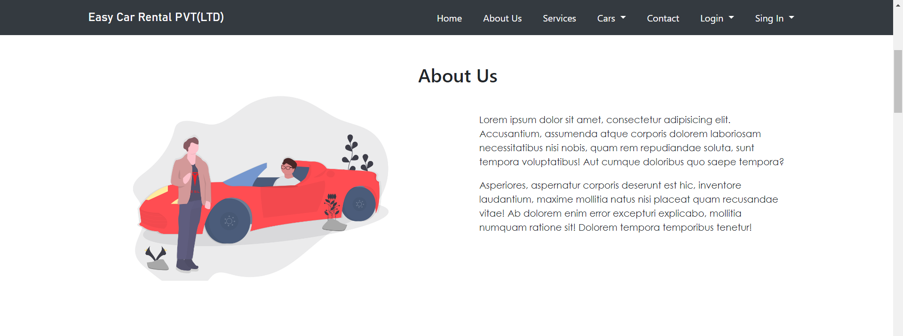
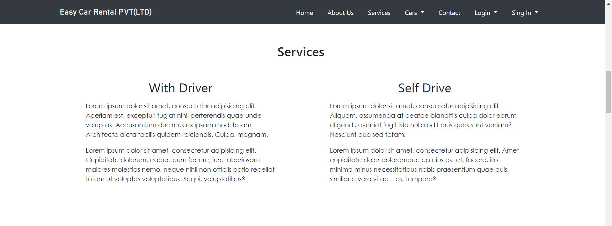
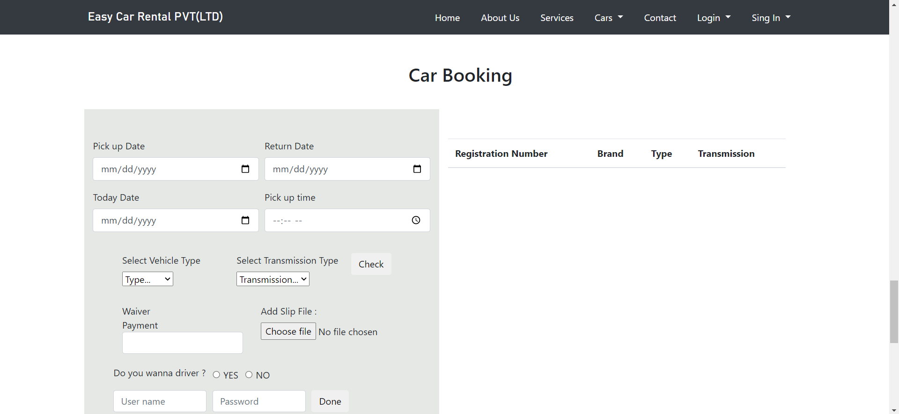
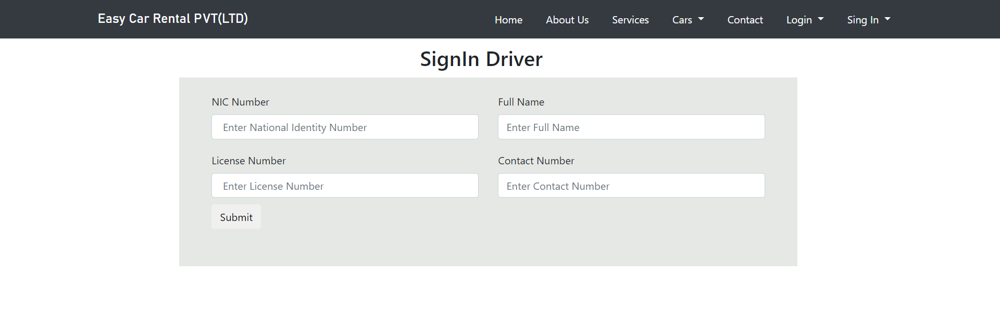
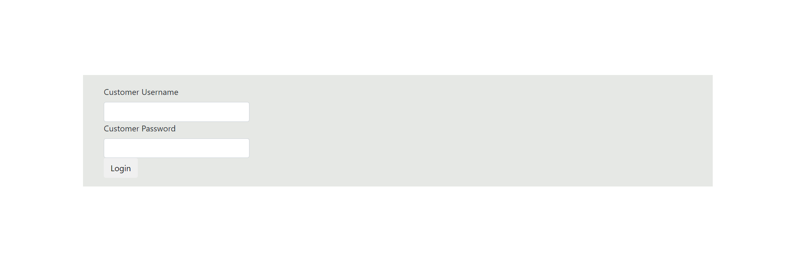

<h2 align="center">Car Rental System Front End</h2>

This project was created for the Advance API Development module 

A website was created to make car reservations for clients 

## <h2 align="left">Languages / Frameworks / Tools / Others:</h2>
* Bootstrap
* CSS
* HTML
* Java script
* JQuery 

## <h2 align="left">Sample Screen Shots:</h2>
<h5>Home</h5>

<h5>About Us</h5>

<h5>Services</h5>

<h5>Car Listing</h5>

<h5>Car Booking</h5>

<h5>Contact</h5>

<h5>Sign In As A Customer</h5>

<h5>Sign In As A Driver</h5>

<h5>Login</h5>

